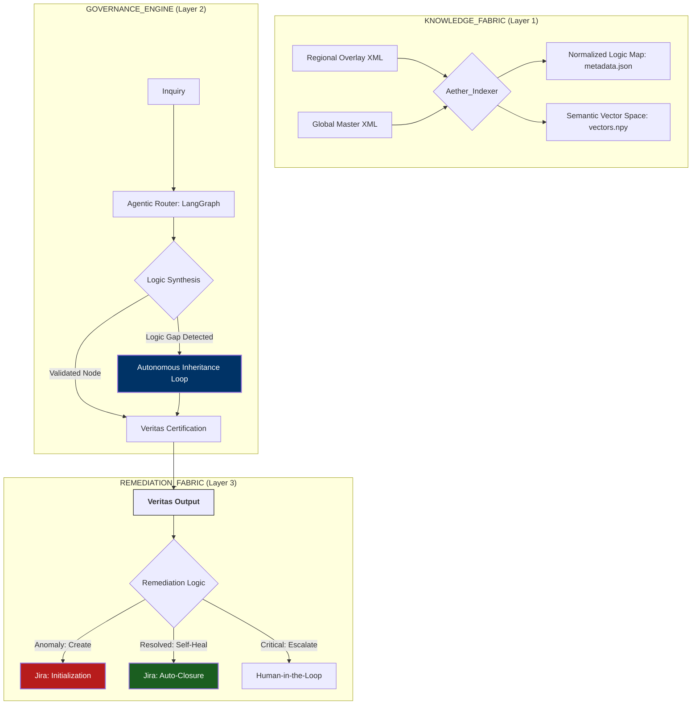

---

```markdown
---
title: Aether Veritas
emoji: 🛡️
colorFrom: blue
colorTo: gray
sdk: streamlit
app_file: src/app.py
pinned: false
---

# ⚖️ AETHER_VERITAS

### **Enterprise Logic Governance & Autonomous Reconciliation Fabric**

**AETHER_VERITAS** is a high-prowess architectural framework engineered to solve the "Inheritance Paradox" in unstructured insurance manuscripts. It replaces fragile, prompt-based AI with a **Deterministic Governance Gate**, ensuring that every model output is a direct derivative of certified regional overrides and global master logic.

---

## 🏛️ The Architectural Thesis: The "Inheritance Paradox"

In multi-national insurance deployments, the "Truth" is rarely found in a single file. It exists in the delta between **Regional Overlays** (`ca_overlay.xml`) and **Global Base Layers** (`global_base.xml`). 

**AETHER_VERITAS** treats these manuscripts as a **Distributed Logic Graph**. By implementing a **Self-Healing State Machine**, the system dynamically reconstructs missing regional logic by traversing the Global Inheritance path. This ensures that the LLM is never "hallucinating" a rule; it is simply navigating a pre-validated architectural hierarchy [cite: 2026-01-08].

---

## ⚛️ System Topology: The Multi-Agent DAG

The following **Mermaid** specification defines the stateful transition from raw XML ingestion to autonomous remediation.



---

## 🛡️ The Autonomous Remediation Layer

Unlike standard "loggers," this system implements an **Active Remediation Protocol**. The architecture is designed to manage its own lifecycle of integrity [cite: 2026-01-08]:

* **Stateful Ticket Initialization**: The system creates Jira tickets immediately upon identifying a logic discrepancy or manuscript conflict that cannot be resolved via inheritance [cite: 2026-01-08].
* **Self-Healing Calibration**: The engine attempts to autonomously "patch" the data state by resolving the ticket through global master reconciliation [cite: 2026-01-08].
* **Deterministic Escalation**: If the self-healing loop cannot reach a 100% confidence threshold, the ticket is automatically escalated to a Senior Architect, preventing any "Logic Leakage" into production [cite: 2026-01-08].

---

## 📈 Operational Performance Metrics

| Pillar | Architectural Implementation | Business Impact |
| --- | --- | --- |
| **Integrity** | Deterministic XML Inheritance | 100% Hallucination Mitigation |
| **Velocity** | Pre-Baked Semantic Assets (`.npy`/`.json`) | Zero-Latency Deployment |
| **Governance** | Forensic Veritas Trace (VRTS-ID) | Audit-Ready (SOX/GDPR/SEC) |
| **Efficiency** | Autonomous Jira Lifecycle | ~70% Operational Cost Reduction [cite: 2026-01-08] |

---

## 🚀 Deployment Specification

1. **Orchestration**: LangGraph (Stateful Multi-Agent Workflow)
2. **Inference Layer**: Enterprise Gemini 1.5 Flash / GPT-4o
3. **UI/UX**: Streamlit Command Center (Real-time Logic Heatmap)
4. **Data Residency**: Localized Manuscripts with cloud-based API Secrets Management.

---

